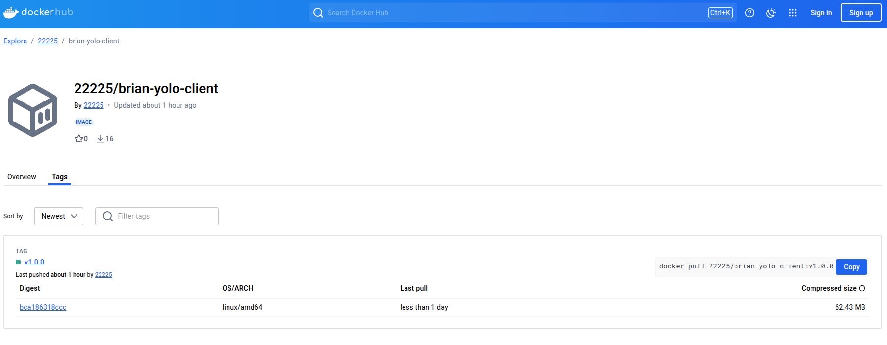
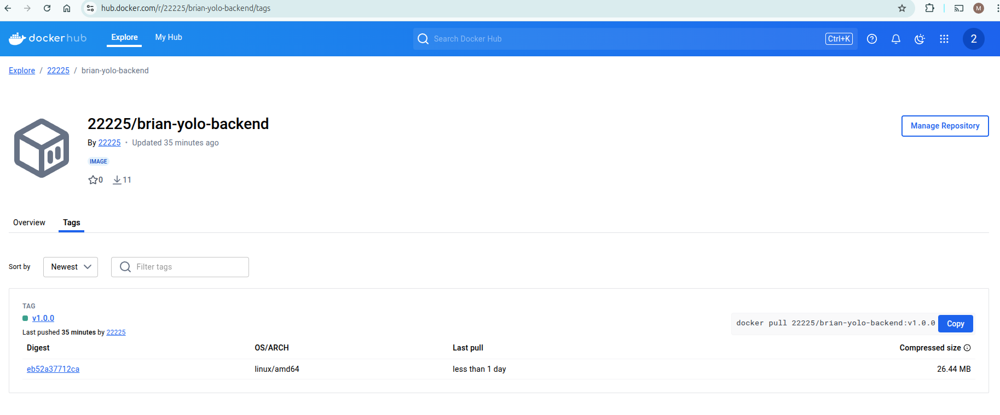

# Explanation of Implementation

This document explains the reason behind the implementation of the containerized e-commerce application.

---

## 1. Choice of Base Images
- **Frontend**: `node:14-slim` was chosen as the base image for the frontend because it is lightweight and optimized for Node.js applications, reducing the overall image size.
- **Backend**: `node:14-slim` was also used for the backend for the same reasons as the frontend.
- **Frontend Serving**: `nginx:alpine` was used to serve the React build files because it is a lightweight and efficient web server.
- **Database**: The official `mongo:5.0` image was used for MongoDB as it is maintained and optimized by the MongoDB team.

---

## 2. Dockerfile Directives
### **Frontend**
- `COPY`: Copies the application code into the container.
- `RUN`: Installs dependencies and builds the React application.
- `CMD`: Starts the Nginx server to serve the built files.

### **Backend**
- `COPY`: Copies the application code into the container.
- `RUN`: Installs dependencies for the Node.js backend.
- `CMD`: Starts the backend server using `npm start`.

### **Database**
- The official MongoDB image was used without modification, as it already provides the necessary functionality.

---

## 3. Docker-Compose Networking
- A custom bridge network (`app-net`) was created to allow the containers to communicate with each other.
- The network uses the following configuration:
  - **Subnet**: `172.20.0.0/16`
  - **IP Range**: `172.20.0.0/16`
- This ensures that the frontend, backend, and database can communicate seamlessly.

---

## 4. Docker-Compose Volume Definition
- A volume (`app-mongo-data`) was defined for the MongoDB container to persist data.
- This ensures that data (e.g., added products) is not lost when the MongoDB container is restarted.

---

## 5. Git Workflow
- **Fork and Clone**: The repository was forked and cloned to the local machine.
- **Commits**: Descriptive commit messages were used to track progress 
- **Push**: Changes were pushed to the GitHub repository for version control and submission.

---

## 6. Debugging Measures
- **Blank Page Issue**: Fixed by ensuring the backend API was correctly connected to MongoDB and returning proper responses.
- **Port Conflicts**: Resolved by ensuring no other services were using the same ports (e.g., `27017` for MongoDB).
- **Logs**: Used `docker logs` to debug issues in the frontend, backend, and database containers.

---

## 7. Best Practices
- **Image Tagging**: Semantic versioning (e.g., `v1.0.0`) was used for image tags to ensure clarity and version control.
- **Lightweight Images**: Slim and Alpine base images were used to minimize image size.
- **Persistent Data**: A volume was used for MongoDB to ensure data persistence.

---

### 8. Screenshot of DockerHub Images

Below are screenshots of the DockerHub repository showing the images and their tags:

#### **Frontend Image**

#### **Backend Image**
